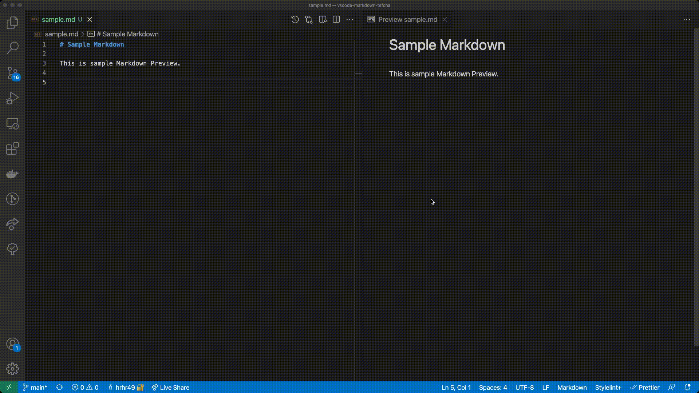

# vscode-markdown-tefcha

Add support for flowchart preview in VS Code's built-in markdown preview.




## Usage

Use `tefcha` fenced code blocks

~~~
```tefcha

# Write pseudo code here

if morning
  hello
end

```
~~~

## Syntax

See `Syntax` section of following URL:
https://github.com/hrhr49/tefcha#readme

### For more information

* https://github.com/hrhr49/tefcha
* https://github.com/hrhr49/vscode-markdown-tefcha
